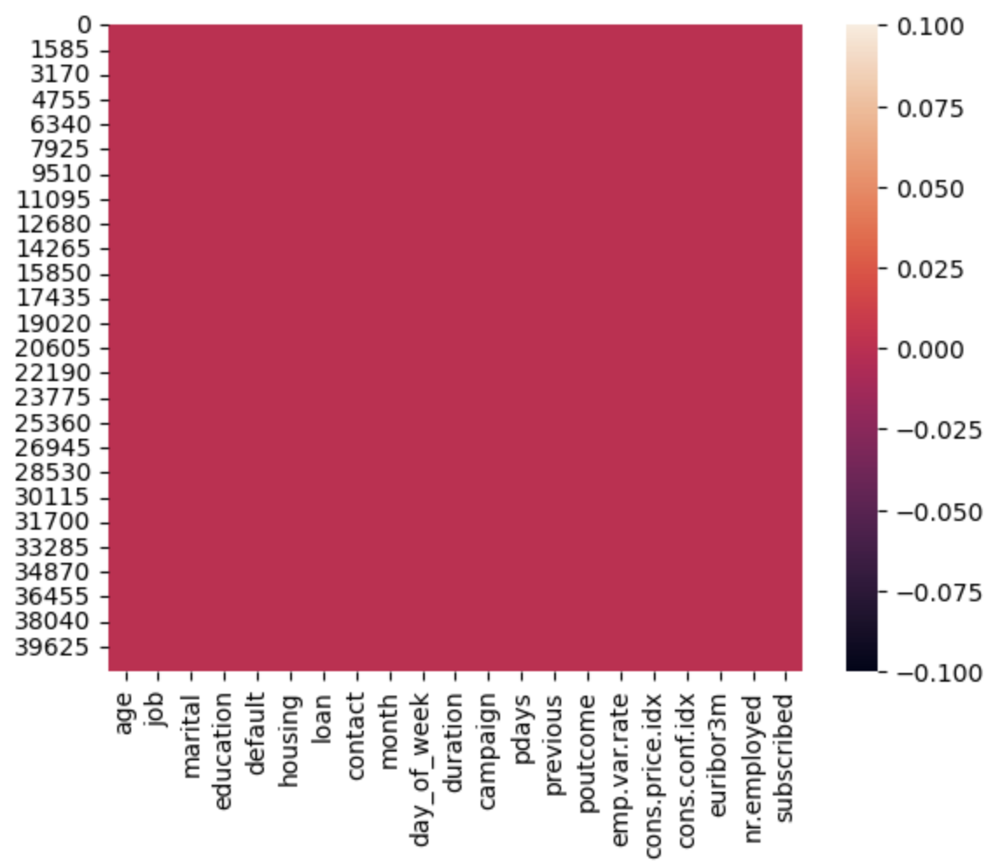
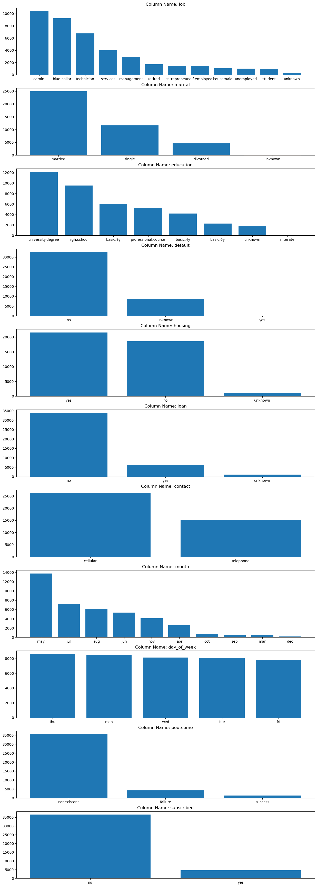
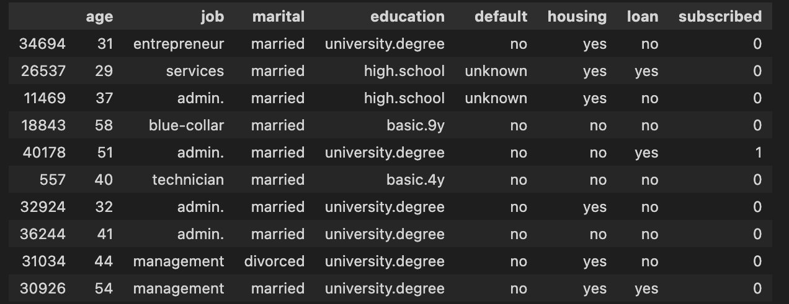
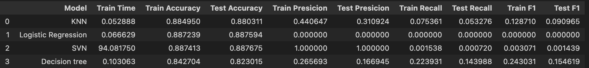
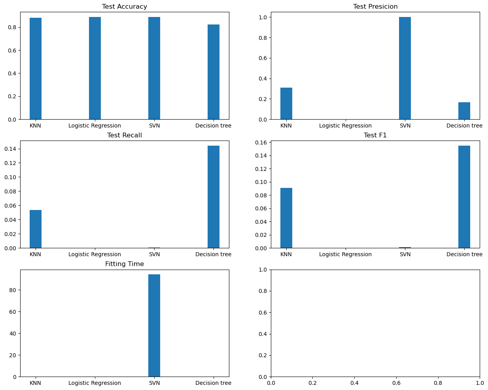
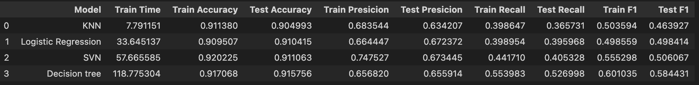
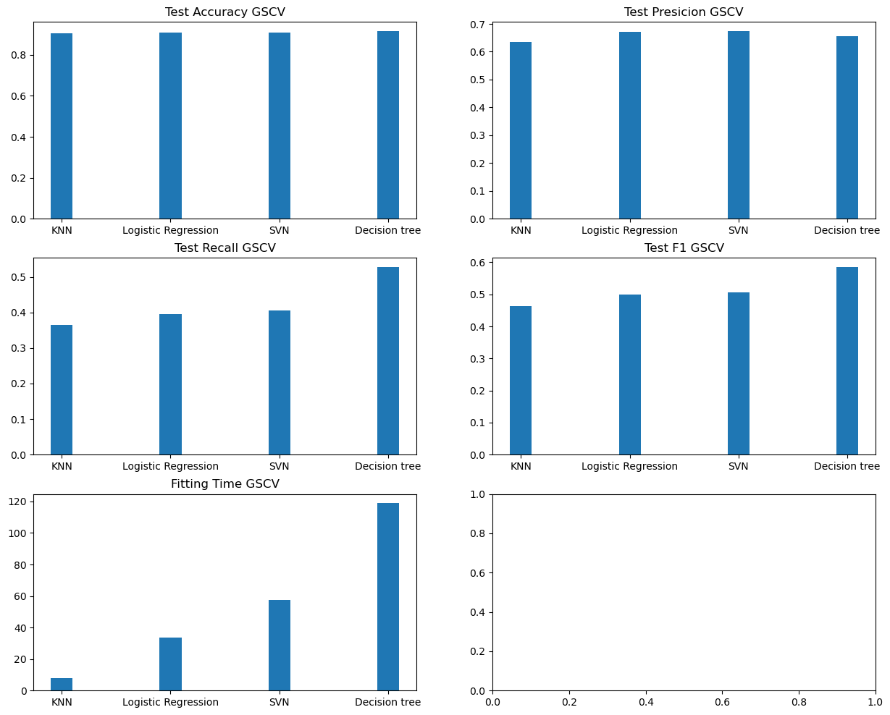
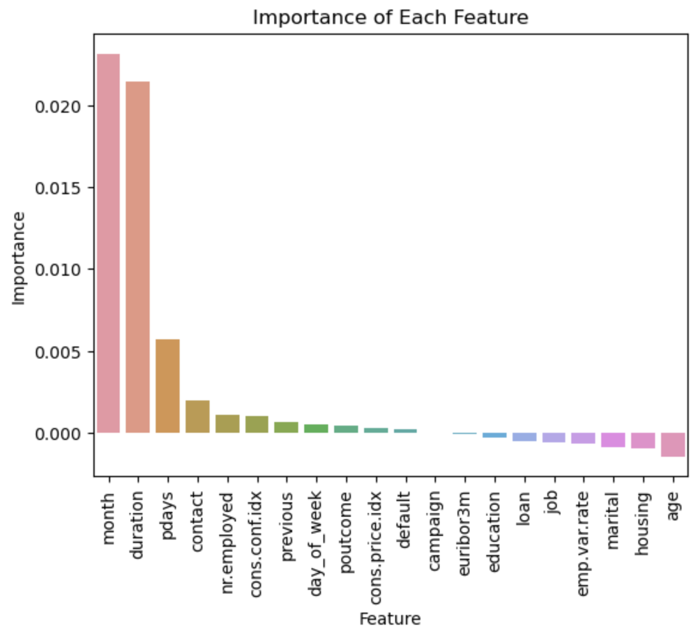
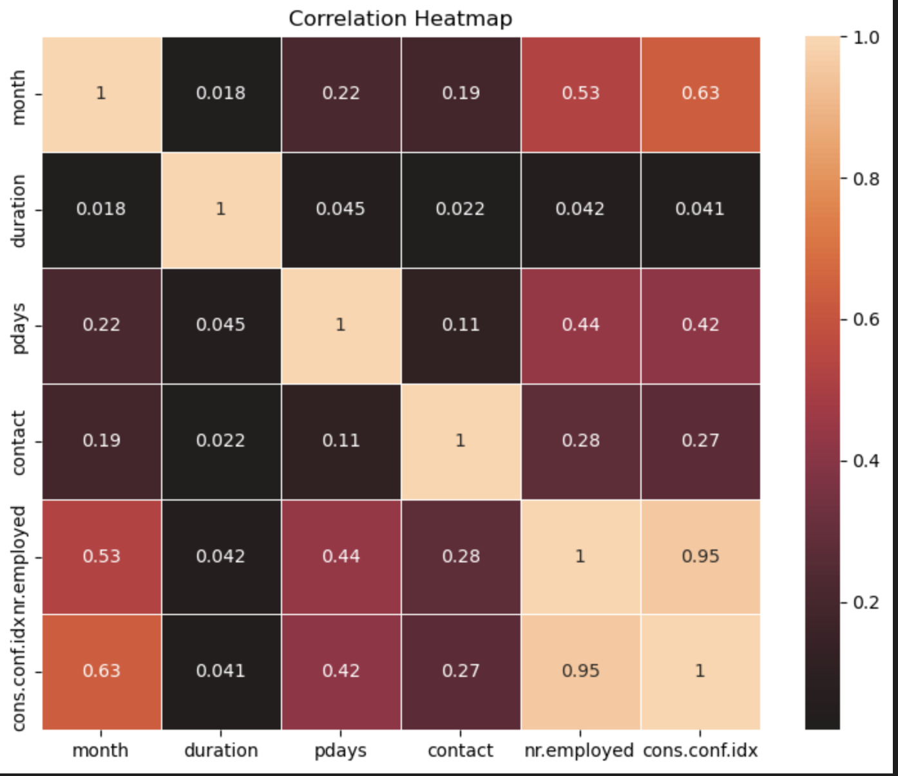

# Practical Application III: Comparing Classifiers
A detailed review of the key elements impacting the decision of bank customers to get a deposit account

## Overview

Our dataset comes from the UCI Machine Learning repository [link](https://archive.ics.uci.edu/ml/datasets/bank+marketing).  The data is from a Portugese banking institution and is a collection of the results of multiple marketing campaigns.  We will make use of the article accompanying the dataset [here](CRISP-DM-BANK.pdf) for more information on the data and features.


# Methodology used 

The CRISP-DM (CRoss Industry Standard  Process  for  Data  Mining)  project addressed  parts  of these  problems  by  defining  a  process  model  which  provides  a  framework  for  carrying  out  data mining  projects  which  is  independent  of  both  the  industry  sector  and  the  technology  used.  The
CRISP-DM  process  model  aims  to  make  large  data  mining  projects,  less  costly,  more  reliable,
more repeatable, more manageable, and faster.


## Business Understanding

The business objetive of this task is to identify which are the most relevant characteristics that influence a client to subscribe or not to a bank deposit account, at the same time that we can predict using these characteristics the clients' decision for its potential use in the segmentation of marketing campaigns, to improve the number of subscribed customers and obtain the greatest benefits in terms of return on investment on said campaigns.

## Data Understanding

This dataset relates to 17 marketing campaigns conducted between May 2008 and November 2010. It includes data for a total of 79,354 contacts.

#### bank client data:
```
1 - age (numeric)
2 - job : type of job (categorical: 'admin.','blue-collar','entrepreneur','housemaid','management','retired','self-employed','services','student','technician','unemployed','unknown')
3 - marital : marital status (categorical: 'divorced','married','single','unknown'; note: 'divorced' means divorced or widowed)
4 - education (categorical: 'basic.4y','basic.6y','basic.9y','high.school','illiterate','professional.course','university.degree','unknown')
5 - default: has credit in default? (categorical: 'no','yes','unknown')
6 - housing: has housing loan? (categorical: 'no','yes','unknown')
7 - loan: has personal loan? (categorical: 'no','yes','unknown')
```

#### related with the last contact of the current campaign:
```
8 - contact: contact communication type (categorical: 'cellular','telephone')
9 - month: last contact month of year (categorical: 'jan', 'feb', 'mar', ..., 'nov', 'dec')
10 - day_of_week: last contact day of the week (categorical: 'mon','tue','wed','thu','fri')
11 - duration: last contact duration, in seconds (numeric). Important note: this attribute highly affects the output target (e.g., if duration=0 then y='no'). Yet, the duration is not known before a call is performed. Also, after the end of the call y is obviously known. Thus, this input should only be included for benchmark purposes and should be discarded if the intention is to have a realistic predictive model.
```

#### other attributes:
```
12 - campaign: number of contacts performed during this campaign and for this client (numeric, includes last contact)
13 - pdays: number of days that passed by after the client was last contacted from a previous campaign (numeric; 999 means client was not previously contacted)
14 - previous: number of contacts performed before this campaign and for this client (numeric)
15 - poutcome: outcome of the previous marketing campaign (categorical: 'failure','nonexistent','success')
```

#### social and economic context attributes
```
16 - emp.var.rate: employment variation rate - quarterly indicator (numeric)
17 - cons.price.idx: consumer price index - monthly indicator (numeric)
18 - cons.conf.idx: consumer confidence index - monthly indicator (numeric)
19 - euribor3m: euribor 3 month rate - daily indicator (numeric)
20 - nr.employed: number of employees - quarterly indicator (numeric)
```

#### Output variable (desired target):
```
21 - y - has the client subscribed a term deposit? (binary: 'yes','no')
```

### Looking for Empty or Null values:

There is not empty or null values over the original dataset provided




## Data Preparation

1. No empty or null values ​​were found on the data provided.
2. We'll be using TargetEncoder to encode categorical columns:
    - 'job', 
    - 'marital', 
    - 'education', 
    - 'default', 
    - 'housing', 
    - 'loan'
3. The target column `y` is renamed as `subscribed` and encoded to 1, 0 (yes, no)




### Sample of the data used:



The data has being prepared by renaming the column `y` to `subscribed`. The other categorical columns will be encoded in runtime when fitting the model.


## Modeling (Classifiers Comparison)

As we are looking to predict if a customer subscribes or not (a boolean result), we'll be using classifiers. In this case, we'll be exploring the following classifiers:

1. Logistic Regression
2. KNeighborsClassifier
3. DecisionTreeClassifier
4. SVN

Previouly to start evaluating the above classifiers, it is necessary to find the baseline to define an acceptable lower point of the accuracy. For this purpose, we'll be using DummyClassifier.

Once the DummyClassifier is evaluated, we found the following as result:

```The scores found using DummyClassifier are: Accuracy: 49.8422%, Recall:49.3694%```

#### Modeling with a simple data and model

For this model, we'll be evaluating based on the bank features.

```
1 - age
2 - job
3 - marital
4 - education
5 - default
6 - housing
7 - loan
```





By reviewing the above results, the `KNN` classifier appear as the best option to be used with the bank data (7 features). Almost all classifiers returns similar accuracy, however the KNN highlight because the fitting time is reduced at the same time as the precision and recall are in good shape.

The resulting accuracy for KNN classifier is: `88.0311%` with a fitting time of `0.05288`


#### Modeling using ALL columns plus GridSearchCSV

During this iteration, we'll be evaluating with all the columns provided looking for the best classifier giving good performance in term of accuracy and fitting time. Here the results:





When using ALL the features provided in the dataset and passing cross the classifiers mentioned above, we found similar results, but with high differences in the fitting time. Considering the accuracy, precision, recall and fitting time, the `KNN` classifier appear as the best option still.

KNN Test accuracy: `90.49993 %` with a fitting time of `7.79`. 

With the latest results we could see the test accuracy has being improved in comparision with the simple model (`All: 90.49993% vs Simple: 88.0311%`) but the fitting time has being increase from `0.05288` to ``7.79`


## Evaluation

Comparing the results above, the `KNN` comes as the best classifier for our data. Considering this as our classifier, we'll be evaluating the importance of the features to decide if we could remove some features based on the importance.


### Features importance




### Reviewing KNN with the most important features

Once identified the most important features, We executed the classification process using only the following featues:

- 'month', 
- 'duration', 
- 'pdays', 
- 'contact', 
- 'nr.employed', 
- 'cons.conf.idx'

The resulting values for the `KNN` classifier are as following:

Test Accuracy Score: `90.4993 %`
Fitting time: `7.318727016448975`

The fitting time is reduced without impacting the accuracy in comparision with the process using ALL features

### Data Correlation

Using the most important features, I would like to show the relation between `subscribed` and other features:



Based on correlation, the `nr.employed` is highly correlated with `cons.conf.idx`.


## Findings

- Considering the first exercise where the data used was limited to 7 features and without performing the lookup of hyperparameters, this was notable the fitting time was better, and the accuracy is not bad. However, when exploring using a second iteration using GridSearchCV to find the hyperparameters the accuracy is improved but the fitting time is increased. This is really important to weight up between resolution speed and scoring (accuracy, recall, f1) when choosing the right model for the predictions.

- Using permutation importante can help us to reduce the fitting time by reducing the amount of characteristics to be evaluated.

- The best classification model for the data considering scoring and fitting time is KNN offering an accuracy score of: `90.4993 %` and a fitting time of: `7.318727016448975`

## Next steps and recommendations

- To implement more models with different cross validation techniques looking to improve the errors.
- To iterate cross different features identified with Performance Importance. The above results contains 6 features, but it is probable we could get different results when executing it with 3 or 4 features